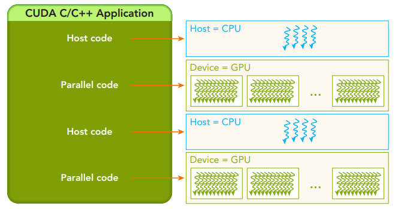

# CUDA introduction 
(images from <a href="https://docs.nvidia.com/cuda/cuda-c-programming-guide/index.html">CUDA programming guide</a>)
## CUDA architecture
  - A GPU is built around an array of Streaming Multiprocessors (SMs).
  - A multithreaded program is partitioned into blocks of threads that execute independently from each other.
  - GPU with more multiprocessors will automatically execute the program in less time than a CPU with fewer multiprocessors.
  
  
  
## Programming Model 
(reference: <a href="http://www.hds.bme.hu/~fhegedus/C++/Professional%20CUDA%20C%20Programming.pdf">Professional CUDA C Programming</a>)
- The CUDA programming model enables you to execute applications on heterogeneous computing
systems
- A heterogeneous environment consists of CPUs complemented by GPUs.
  

- <B>Host</B>: the CPU and its memory (host memory).
- <B>Device</B>: the GPU and its memory (device memory).

A typical processing fl ow of a CUDA program follows this pattern:

  
