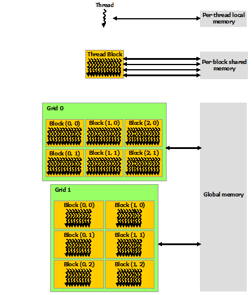

# CUDA introduction 
(images from <a href="https://docs.nvidia.com/cuda/cuda-c-programming-guide/index.html">CUDA programming guide</a>)
## CUDA architecture
  - A GPU is built around an array of Streaming Multiprocessors (SMs).
  - A multithreaded program is partitioned into blocks of threads that execute independently from each other.
  - GPU with more multiprocessors will automatically execute the program in less time than a CPU with fewer multiprocessors.
  
  
  
## Programming Model 
(reference: <a href="http://www.hds.bme.hu/~fhegedus/C++/Professional%20CUDA%20C%20Programming.pdf">Professional CUDA C Programming</a>)
- The CUDA programming model enables you to execute applications on heterogeneous computing
systems
- A heterogeneous environment consists of CPUs complemented by GPUs.
  

- <B>Host</B>: the CPU and its memory (host memory).
- <B>Device</B>: the GPU and its memory (device memory).

## A typical processing flow of a CUDA program follows this pattern:
- Copy data from CPU memory to GPU memory.
- Invoke kernels to operate on the data stored in GPU memory.
- Copy data back from GPU memory to CPU memory.

## Organizing Threads
  When a kernel function is launched from the host side, execution is moved to a device where a large
number of threads are generated and each thread executes the statements specified by the
kernel function. 
CUDA organizes grids and blocks in three dimensions.
- blockDim (block dimension, measured in threads)
- gridDim (grid dimension, measured in blocks)

Threads rely on the following two unique coordinates to distinguish themselves from each other:
- blockIdx (block index within a grid)
   blockIdx.x
   blockIdx.y
   blockIdx.z
- threadIdx (thread index within a block)
   threadIdx.x
   threadIdx.y
   threadIdx.z

  
