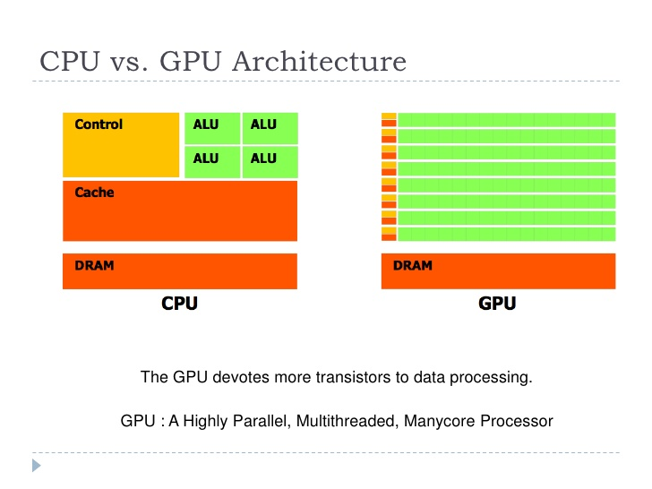
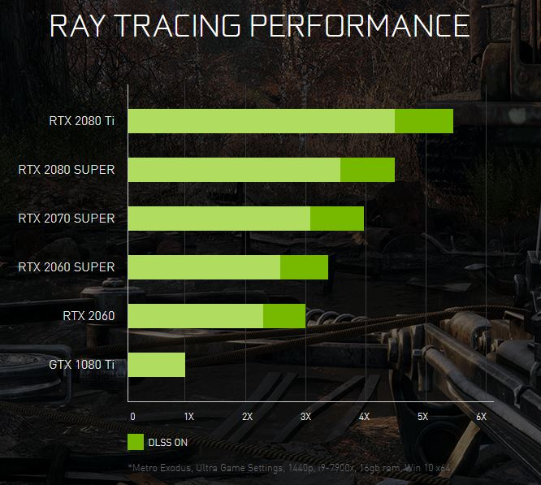
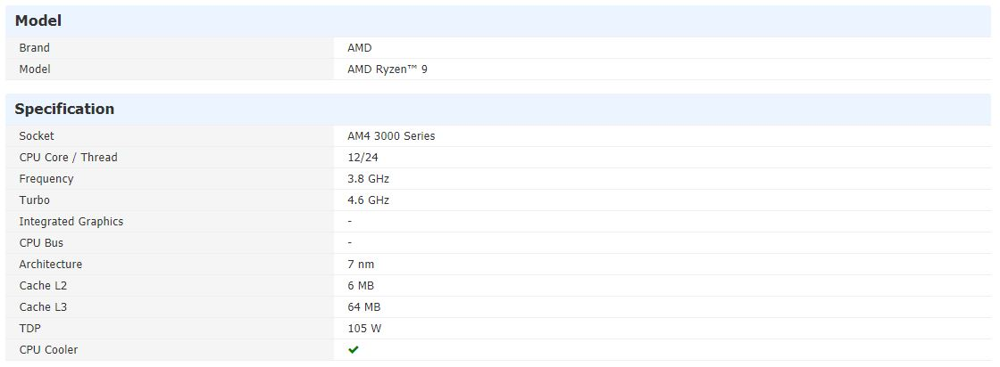
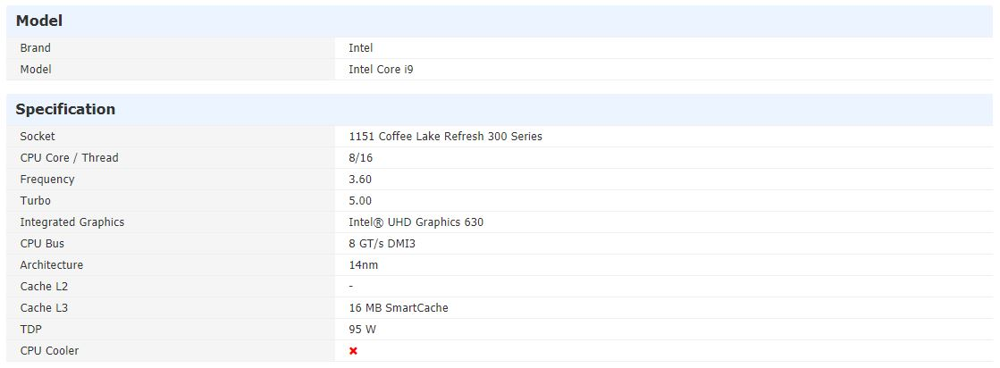

# Outline
- Introduction to GPU
- Compute Unified Device Architecture:CUDA
- CUDA C on Google colab
- PyCUDA on Google colab
- CUDA Machine Learning

# Introduction to GPU
- The Graphic Processing Unit (GPU) is a processor that was specialized for processing graphics.
- The GPU has recently evolved towards a more flexible architecture.
- Opportunity: We can implement *any algorithm*, not only graphics.
- Challenge: obtain efficiency and high performance.
## Difference between CPU and GPU

##GPU computing 
- key ideas:
- Massively parallel
- Hundreds of cores
- Thousands of threads
- Programable

