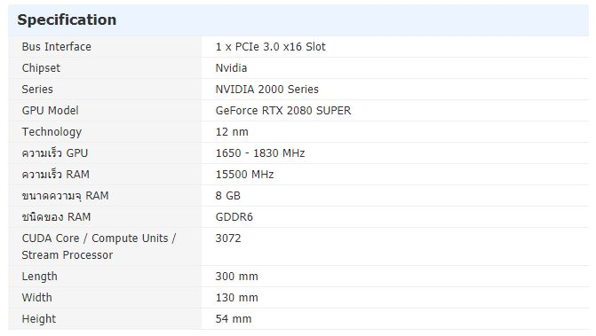
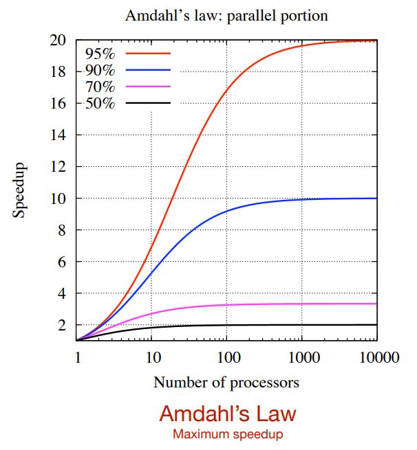

# Outline
- Introduction to GPU
- Compute Unified Device Architecture:CUDA
- CUDA C on Google colab
- PyCUDA on Google colab
- CUDA Machine Learning

# Introduction to GPU
- The Graphic Processing Unit (GPU) is a processor that was specialized for processing graphics.
- The GPU has recently evolved towards a more flexible architecture.
- Opportunity: We can implement *any algorithm*, not only graphics.
- Challenge: obtain efficiency and high performance.
## Difference between CPU and GPU

## GPU computing 
- key ideas:
- Massively parallel
- Hundreds of cores
- Thousands of threads
- Programable

## Why accelerator technology today?
- Investment on GPU technology makes more sense today than in 2004. 
- CPU uni-processor speed is not doubling every 2 years anymore!
- Case: investing in an accelerator that gives ~10x speedup:
  - TODAY speedup 1.15x per year: 10x today would be 4.9x acceleration in 5 years.
  - Consider the point that GPU parallel performance is doubling every 18 months!

# Can we get 100x speedups?
- You can get hundred-fold speedup for some algorithms.
- It depends on the non-parallel part: Amdahl’s law.
- Look for alternative ways to perform the computations that are more parallel.
- An accelerated program is going to be as fast as its serial part.

Next>> [Compute Unified Device Architecture:CUDA](Introduction.md)
